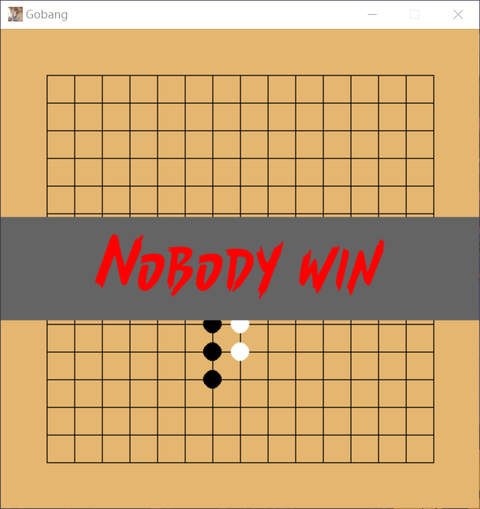

## 五子棋
人工智能程序实验报告
##### 211502024 贺卓宇

程序运行和游玩方法:
README.md

### 选题描述
五子棋是历史悠久益智棋类游戏，老少皆宜
选题实现了图形化的本地五子棋对战程序，采用了适合萌新的无禁手规则，并提供了玩家对战，人机对战和电脑互博等模式可供玩家选择。
### 设计方案
**五子棋选题分析:**
用户按规则对棋盘进行修改，并根据棋盘状态进行判定。
因此设计思路主要分为四个部分:

1.棋盘类对象

    棋盘数据存储
    棋盘状态判定    
    
2.游戏逻辑部分-体现五子棋规则-整合各个模块的部分

    大循环-不断重复游戏进程
    游戏进程
        数据初始化
        目录
          模式选择
        游戏过程-主循环
          玩家轮流落子
          判断结果
            若结果已分，显示结果退出循环
        游戏结束
    游戏进程每一步都按照一下流程
        (玩家在图形化界面操作)->修改游戏数据->展示在图形化界面过程
            
3.图形化界面-用户交互
    
    目录，游戏结果等元素绘制
    棋盘数据图形化绘制
    用户输入格式化
      将键盘，鼠标点击事件翻译成用户操作

4.电脑策略

    采用min-max搜索树作为算法
    并使用了alpha-beta剪枝优化
    估价上采取
### 模块介绍
**代码均存放在src中**
#### board
board.py
定义了棋盘类和部分状态判定函数
数据存储方式:二维列表
```python
class board:
  pass
# 新建棋盘对象实例
B=board()
# 类常数说明
board.BLACK # 黑棋
board.WHITE # 白棋
board.EMPTY # 空
# 数据访问示例
  B[3][4] # 访问三行四列的棋子类型(BLACK,WHITE,EMPTY)
  # 说明
  # 棋盘大小为15x15,从0行0列开始
# 成员函数说明
def move(self,pos:tuple,typ)->bool:
  '''
    在棋盘pos位置落下类型为typ的棋子
    返回值:落子位置的合法性(合法:True,非法:False)
    pos:tuple(row,column)
    typ:BLACK WHITE
    notice:
      合法性未检验坐标范围
  '''
  pass
def delete(self,pos:tuple)->None:
  '''
    清除pos位置的棋子
    pos:tuple(row,column)
    notice:
      未检验坐标范围合法性
  '''
  pass
def is_full(self)->bool:
  '''
    判断棋盘是否还有落子位置
    返回值:无(平局情况)->True 有地方落子->False
  '''
  pass
def is_empty(self)->bool:
  '''
    判断棋盘是否为空棋盘(初试状态)
    返回值:空(全为EMPTY)->True 其他->False
  '''
  pass
```
#### graphics
图形化与交互模块
主要通过pygame与图形窗口与用户进行交互
**素材**
目录和结果使用字体文件
`Font/Bustracks-FREE-3.tff`
**代码部分**
graphics.py
```python
# 绘制参数常量
##  详见代码注释,主要为图形元素的大小设计等数值
# 模块方法介绍
## 外部方法
def graphics_init()->pygame.Surface:
  '''
    图形化模块初试化
    包含:
      pygame的初始化
      图形窗口初试化
    返回值:
      pygame的Surface类，即封装好的窗口对象
  '''
  pass
def draw_borad(screen)->None:
  ''' 
    每局游戏开始时，绘制空棋盘
  '''
  pass
def draw_chess(screen,pos,typ)->None:
  '''
    在pos位置绘制typ类型
    pos:tuple(row,column)
    typ:board.WHITE/board.BlACK
  '''
  pass
def get_pos_from_mouse(event_pos)->tuple:
  '''
    将pygame获取的用户窗口点击坐标，转换为棋盘上的落子坐标
    返回值:tuple(row,column)
  '''
  pass
def draw_menu(screen,Mod):
  '''
    绘制目录界面
    Mod:当前选择的模式
  '''
  pass
def draw_win_title(screen,win):
  '''
    绘制结果横幅
    win:board.BLACK board.WHITE  3(平局)
  '''
  pass


## 内部调用
def draw_a_line(screen,points)->None:
  '''
    对pygame.draw.lines的封装(粗细，颜色)
    用来画棋盘的线
  '''
  pass
def draw_lines(screen,points)->None:
  '''
    不断调用draw_a_line
    完整的绘制棋盘
  '''
  pass
```
#### 游戏逻辑模块(主程序)
main.py
将各个模块按照功能组合起来，按照规则实现游戏逻辑
实现上参考设计思路对应实现
```python
def play_at_gui():
  '''
    大循环，不断重复游戏进程
  '''
  screen=graphics_init()
  while new_game_at_gui(screen):
    None
def new_game_at_gui(screen):
  '''
    游戏进程，按照规则对应实现
    下方为不完整代码，详见main.py
  '''
  B=board() # 数据初始化
  # 模式选择
  choose_Mod(screen)
  player=[0,(Mod//2)%2,Mod%2] #模式代表玩家类型
  # Mod[0,3] 两位二进制位表示黑棋和白棋的棋手是玩家还是人机
  
  
  # 初始化棋盘绘制
  draw_borad(screen)
  # 主循环条件初始化
  cnt=board.BLACK #cnt为当前执方，黑棋先手
  win=0           #win为当前结果信息
  
  # 主循环
  while not win:
    # 按照玩家类型和当前执方获取落子坐标
    pos=get_pos(B,cnt,player[cnt])
    if B.move(pos,cnt): # 落子合法则落子并绘制
      if B.is_win(cnt): # 胜利判定
      if B.is_full():   # 平局判定
      cnt=switch_chess_typ(cnt) # 交换执方
    else:
      # 重新获取坐标
  
  # 绘制结果信息
  draw_win_title(screen,win)  

  # 按任意键开始新游戏
  ## 略

  # 返回大循环，开始新一局游戏
  return True


# 图形化交互和数据修改
def get_pos(B:board,typ,player_typ)->tuple:
  '''
    根据player_typ来决定获取落子的坐标的方式
    player_typ:玩家->0 电脑->1
    玩家:
      获取鼠标点击坐标，并转换成棋盘行列坐标
    电脑:
      调用ai.get_pos(B,typ)方法,获取算法计算结果坐标
  '''
  pass
def choose_Mod(screen)->None:
  '''
    让用户选择模式，并不断绘制更换模式的目录
    直到用户回车确认
    使用global Mod，会按照最终选择的模式修改全局变量Mod
  '''
  pass
```
#### AI模块
ai02.py
实现思路:

    min-max搜索树+alphabeta剪枝优化

模块参数介绍:

    depth:搜索深度，min-max搜索树的深度
    width:搜索宽度限制，每层搜索选择最看好的width个点进行搜索

核心方法:
```python
def get_pos(B:board,typ)->tuple:
  '''
    B:传入棋盘数据
    typ:当前执方 board.BLACK board.WHITE
    返回值:tuple(row,column)
  '''
  pass
```
内部方法:
```python
def min_max_dfs(B:board,typ,d,value,alpha=-INF,beta=-INF)->tuple:
  '''
    min-max搜索树+alphabeta剪枝过程函数
    返回值tuple(tuple(row,column),value)
  '''
  pass
def calc(lst:list,typ)->int:
  '''
    估价辅助函数，站在typ棋子方的视角
    对某一行(列，对角线，反对角线)lst进行棋型匹配
  '''
  pass
def evaluate(B:board,typ)->int:
  '''
    站在typ类型视角对棋盘进行整体估价
  '''
  pass
def judge_pos(B:board,typ,pos)->int:
  '''
    对单个点的估价函数
    即在棋盘B的pos位置下typ类型棋子后的估价
    减小每次对整体估价的开销
  '''
  pass
```
### 实际效果
#### 目录界面

#### 模式切换后界面

#### 游戏过程示例

#### 游戏结果界面
**黑棋胜利**

**白棋胜利**

**平局结果**

备注(ps.)
平局结果经过测试！
手贱点了一下遂开始下一局，故使用魔法打印平局信息
下面是平局前的合影


### 遇到的问题
#### pygame
问题：在搜索过程中，耗时长的话，pygame事件队列占满，导致窗口未响应
解决方案：减少搜索的深度和宽度限制，使得搜索效率提升

问题：绘制过程中，窗口可能卡顿导致未能更新成功
解决方案：在部分关键结点增加刷新窗口的次数减小棋子未绘制的可能

### 拓展性
#### 对作业三的拓展性
按模块划分好，实现机器学习或神经网络的策略是只需按要求提供get_pos的接口，其他地方无需改动
#### 各模块的可拓展性
各模块依赖性弱，按照接口交互，只要接口相同便能修改，实现代码复用。即每个模块可以单独改动内容而不影响整体。
eg.
**board**
修改状态判定函数便可直接支持禁手规则
**graphics**
图形化界面元素固定，只需修改相关绘制的函数调用，便可采用其他图形化库的实现。或者方便修改元素的样式。
### Reference
[[1].知乎-Dylan的专栏-五子棋入门级AI的设计与实现](https://zhuanlan.zhihu.com/p/25650252)
